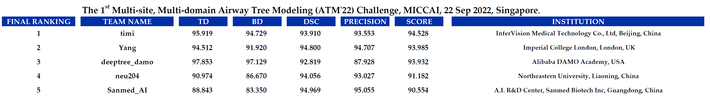

## ATM'22 Challenge Top 5 Solution

We collected the Top-5 solution participated in our ATM'22 challenge for the research community. Please find the following code links:

<!-- |2||2||2||2||2|| -->
| Team Name | Code | Team Name | Code | Team Name | Code | Team Name | Code | Team Name | Code | 
|:----:| :----:|:----:| :----:|:----:| :----:|:----:| :----:|:----:| :----:|
| 1. timi | [Link](https://github.com/Puzzled-Hui/ATM-22-Related-Work/tree/main/ATM22-Challenge-Top5-Solution/team_timi) | 2. Yang | [Link]() | 3. timi | [Link]() | 4. timi | [Link]() | 5. timi | [Link]() | 