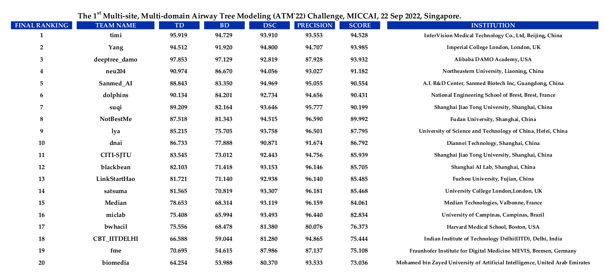

# ATM2022
## First place approach (team timi) for MICCAI 2022 challenge ATM

Build based on https://github.com/haozheng-sjtu/3d-airway-segmentation and 
https://github.com/haozheng-sjtu/Local-imbalance-based-Weight

Use file train2.py and train.py to train and test the model.

The folder docker is the final model docker file, which can be built to auto test.

More information will be added.
