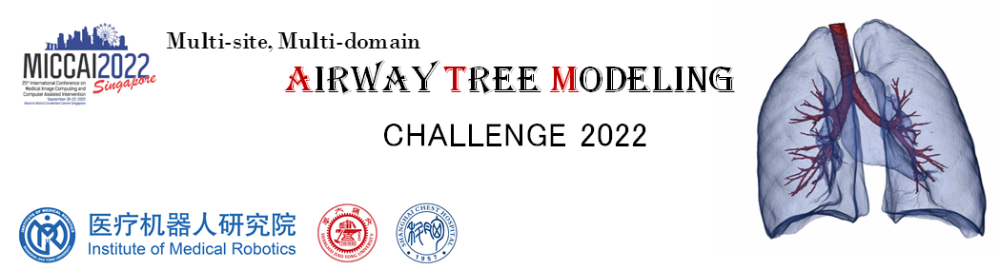

# Airway Tree Modeling (ATM'22) Related Work
<div align=center></div>

Official repository for MICCAI 2022 Challenge: [**Multi-site, Multi-Domain Airway Tree Modeling (ATM’22)**](https://atm22.grand-challenge.org/homepage/).


We provide a baseline model and a detailed docker tutorial for the [ATM 22 Challenge](https://atm22.grand-challenge.org/homepage/). Please refer to [**baseline-and-docker-example**](https://github.com/Puzzled-Hui/ATM-22-Related-Work/tree/main/baseline-and-docker-example) for detailed instructions.

Airway segmentation is a crucial step for the analysis of pulmonary diseases including asthma, bronchiectasis, and emphysema. The accurate segmentation based on X-Ray computed tomography (CT) enables the quantitative measurements of airway dimensions and wall thickness, which can reveal the abnormality of patients with chronic obstructive pulmonary disease (COPD). Besides, the extraction of patient-specific airway models from CT images is required for navigation in bronchoscopic-assisted surgery. Due to the fine-grained pulmonary airway structure, manual annotation is however time-consuming, error-prone, and highly relies on the expertise of clinicians.

We collected 500 CT scans from multi-sites. The airway tree structures are carefully labeled by three radiologists with more than five years of professional experience. The intra-class imbalance among the trachea, main bronchi, lobar bronchi, and distal segmental bronchi affects the segmentation performance of peripheral bronchi. In conclusion, we encourage the participating teams to design robust algorithms, which can extract the airway tree structure with high topological completeness and accuracy for clinical use. Our challenge is open call (challenge opens for new submissions after MICCAI 2022 deadline). The registration page and detailed information could refer to the [**Registration Page**](https://atm22.grand-challenge.org/registration/).

If you find this repo's papers and codes are helpful to your research, and if you use our dataset provided by ATM'22 for your scientific research, **please cite the following works:**

```
@incollection{zhang2021fda,
  title={Fda: Feature decomposition and aggregation for robust airway segmentation},
  author={Zhang, Minghui and Yu, Xin and Zhang, Hanxiao and Zheng, Hao and Yu, Weihao and Pan, Hong and Cai, Xiangran and Gu, Yun},
  booktitle={Domain Adaptation and Representation Transfer, and Affordable Healthcare and AI for Resource Diverse Global Health},
  pages={25--34},
  year={2021},
  publisher={Springer}
}

@article{zheng2021alleviating,
  title={Alleviating class-wise gradient imbalance for pulmonary airway segmentation},
  author={Zheng, Hao and Qin, Yulei and Gu, Yun and Xie, Fangfang and Yang, Jie and Sun, Jiayuan and Yang, Guang-Zhong},
  journal={IEEE Transactions on Medical Imaging},
  volume={40},
  number={9},
  pages={2452--2462},
  year={2021},
  publisher={IEEE}
}

@inproceedings{yu2022break,
  title={BREAK: Bronchi Reconstruction by gEodesic transformation And sKeleton embedding},
  author={Yu, Weihao and Zheng, Hao and Zhang, Minghui and Zhang, Hanxiao and Sun, Jiayuan and Yang, Jie},
  booktitle={2022 IEEE 19th International Symposium on Biomedical Imaging (ISBI)},
  pages={1--5},
  year={2022},
  organization={IEEE}
}

@inproceedings{qin2019airwaynet,
  title={Airwaynet: a voxel-connectivity aware approach for accurate airway segmentation using convolutional neural networks},
  author={Qin, Yulei and Chen, Mingjian and Zheng, Hao and Gu, Yun and Shen, Mali and Yang, Jie and Huang, Xiaolin and Zhu, Yue-Min and Yang, Guang-Zhong},
  booktitle={International Conference on Medical Image Computing and Computer-Assisted Intervention},
  pages={212--220},
  year={2019},
  organization={Springer}
}
```

### Related Pulmonary Airway Segmentation Work
We collected the papers related to pulmonary airway segmentation and bronchoscopy navigation as belows:
<!-- |2|[]()|[]()|2|[]()| -->
| Date | Author | Title |     Conf/Jour      | Code |
|:----:| :---: | :---: |:------------------:| :---: |
| 2022 |[Wehao Yu](https://scholar.google.com/citations?hl=zh-CN&user=fCzlLE4AAAAJ)|[TNN: Tree Neural Network for Airway Anatomical Labeling](https://ieeexplore.ieee.org/document/9878127)|      IEEE TMI      |[Official](https://github.com/haozheng-sjtu/airway-labeling)|
| 2022 |[Yun Gu](https://scholar.google.com/citations?user=0pX32mkAAAAJ&hl=zh-CN)|[Vision-Kinematics-Interaction for Robotic-Assisted Bronchoscopy Navigation](https://ieeexplore.ieee.org/document/9830773)|      IEEE TMI      |[——]()|
| 2022 |[Minghui Zhang](https://scholar.google.com/citations?hl=zh-CN&user=CepcxZcAAAAJ)|[CFDA: Collaborative Feature Disentanglement and Augmentation for Pulmonary Airway TreeModeling of COVID-19 CTs]()|       MICCAI       |[Official](https://github.com/Puzzled-Hui/CFDA)|
| 2022 |[Haifan Gong](https://haifangong.github.io/)|[BronchusNet: Region and Structure Prior Embedded Representation Learning for Bronchus Segmentation and Classification](https://arxiv.org/abs/2205.06947)|       Arxiv        |[——]()|
| 2021 |[Wehao Yu](https://scholar.google.com/citations?hl=zh-CN&user=fCzlLE4AAAAJ)|[BREAK: Bronchi Reconstruction by gEodesic transformation And sKeleton embedding](https://ieeexplore.ieee.org/abstract/document/9761697/)|        ISBI        |[——]()|
| 2021 |[Yangqian Wu](https://www.researchgate.net/profile/Yangqian-Wu)|[LTSP: long-term slice propagation for accurate airway segmentation](https://link.springer.com/article/10.1007/s11548-022-02582-7)|       IJCARS       |[——]()|
| 2021 |[Minghui Zhang](https://scholar.google.com/citations?hl=zh-CN&user=CepcxZcAAAAJ)|[Fda: Feature decomposition and aggregation for robust airway segmentation](https://link.springer.com/chapter/10.1007/978-3-030-87722-4_3)|    DART@MICCAI     |[——]()|
| 2021 |[Hao Zheng](https://scholar.google.com/citations?hl=zh-CN&user=LsJVCSoAAAAJ&view_op=list_works&sortby=pubdate)|[Refined Local-imbalance-based Weight for Airway Segmentation in CT](https://link.springer.com/chapter/10.1007/978-3-030-87193-2_39)|       MICCAI       |[Official](https://github.com/haozheng-sjtu/Local-imbalance-based-Weight)|
| 2021 |[Hao Zheng](https://scholar.google.com/citations?hl=zh-CN&user=LsJVCSoAAAAJ&view_op=list_works&sortby=pubdate)|[Alleviating class-wise gradient imbalance for pulmonary airway segmentation](https://ieeexplore.ieee.org/abstract/document/9427208/)|      IEEE TMI      |[Official](https://github.com/haozheng-sjtu/3d-airway-segmentation)|
| 2021 |[A. Garcia-Uceda Juarez](https://scholar.google.com/citations?user=5pLmIVYAAAAJ&hl=zh-CN&oi=sra)|[Automatic airway segmentation from Computed Tomography using robust and efficient 3-D convolutional neural networks](https://www.researchgate.net/profile/Raghavendra-Selvan-2/publication/350512163_Automatic_airway_segmentation_from_Computed_Tomography_using_robust_and_efficient_3-D_convolutional_neural_networks/links/60674588299bf1252e2432b1/Automatic-airway-segmentation-from-Computed-Tomography-using-robust-and-efficient-3-D-convolutional-neural-networks.pdf)| Scientific Reports |[Official](https://github.com/antonioguj/bronchinet)|
| 2020 |[Hanxiao Zhang]()|[Pathological airway segmentation with cascaded neural networks for bronchoscopic navigation](https://ieeexplore.ieee.org/abstract/document/9196756)|     IEEE ICRA      |[——]()|
| 2020 |[Yulei Qin](https://scholar.google.com/citations?user=vBnuTjwAAAAJ&hl=zh-CN&oi=sra)|[Learning Tubule-Sensitive CNNs for Pulmonary Airway and Artery-Vein Segmentation in CT](https://ieeexplore.ieee.org/abstract/document/9363945)|      IEEE TMI      |[Official](http://www.pami.sjtu.edu.cn/Show/56/146)|
| 2020 |[Raghavendra Selvan](https://raghavian.github.io/)|[Graph refinement based airway extraction using mean-field networks and graph neural networks](https://www.sciencedirect.com/science/article/pii/S1361841520301158)|        MIA         |[Official](https://github.com/raghavian/graph_refinement)|
| 2019 |[Jihye Yun](https://sites.google.com/view/jihyeyunphd)|[Improvement of fully automated airway segmentation on volumetric computed tomographic images using a 2.5 dimensional convolutional neural net](https://www.sciencedirect.com/science/article/pii/S1361841518308508)|        MIA         |[——]()|
| 2019 |[Chenglong Wang](https://scholar.google.com/citations?user=pLtUR5cAAAAJ&hl=zh-CN&oi=sra)|[Tubular structure segmentation using spatial fully connected network with radial distance loss for 3D medical images](https://link.springer.com/chapter/10.1007/978-3-030-32226-7_39)|       MICCAI       |[——]()|
| 2019 |[A. Garcia-Uceda Juarez](https://scholar.google.com/citations?user=5pLmIVYAAAAJ&hl=zh-CN&oi=sra)|[A joint 3D UNet-graph neural network-based method for airway segmentation from chest CTs](https://link.springer.com/chapter/10.1007/978-3-030-32692-0_67)|    MLMI@MICCAI     |[——]()|
| 2019 |[Yulei Qin](https://scholar.google.com/citations?user=vBnuTjwAAAAJ&hl=zh-CN&oi=sra)|[AirwayNet: A Voxel-Connectivity Aware Approach for Accurate Airway Segmentation Using Convolutional Neural Networks](https://link.springer.com/chapter/10.1007/978-3-030-32226-7_24)|       MICCAI       |[——]()|
| 2017 |[Qier Meng](https://scholar.google.com/citations?user=mVPvS2AAAAAJ&hl=zh-CN&oi=sra)|[Tracking and segmentation of the airways in chest CT using a fully convolutional network](https://link.springer.com/chapter/10.1007/978-3-319-66185-8_23)|       MICCAI       |[——]()|
| 2017 |[Jean-Paul Charbonnier](https://scholar.google.com/citations?user=K8Pz4m0AAAAJ&hl=zh-CN&oi=sra)|[Improving airway segmentation in computed tomography using leak detection with convolutional networks](https://www.sciencedirect.com/science/article/pii/S136184151630202X)|        MIA         |[——]()|
| 2017 |[Dakai Jin](https://dakjin.github.io/)|[3D convolutional neural networks with graph refinement for airway segmentation using incomplete data labels](https://link.springer.com/chapter/10.1007/978-3-319-67389-9_17)|    MLMI@MICCAI     |[——]()|
| 2015 |[Ziyue Xu](https://scholar.google.com/citations?hl=zh-CN&user=gmUta74AAAAJ)|[A hybrid method for airway segmentation and automated measurement of bronchial wall thickness on CT](https://www.sciencedirect.com/science/article/pii/S1361841515000705)|        MIA         |[——]()|
| 2012 |[Pechin Lo](https://scholar.google.com/citations?user=p6V4-AUAAAAJ&hl=zh-CN&oi=sra)|[Extraction of airways from CT (EXACT'09)](https://ieeexplore.ieee.org/abstract/document/6249784)|      IEEE TMI      |[——]()|


### The Docker Tutorial for the ATM_22 Test Phase Submission
We provide a baseline model and a detailed docker tutorial for the [ATM 22 Challenge](https://atm22.grand-challenge.org/homepage/). Please refer to [baseline-and-docker-example](https://github.com/Puzzled-Hui/ATM-22-Related-Work/tree/main/baseline-and-docker-example) for detailed instructions.


