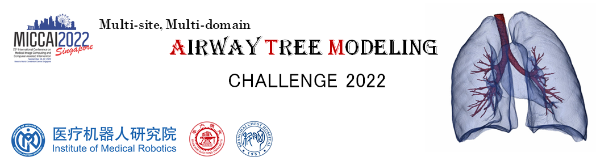

# The Docker Tutorial for the ATM_22 Test Phase Submission
<div align=center></div>

## 1. Build a Docker Image
The configuration of the docker image should be correctly set in `DockerFile`, and then you could build the docker image with your teamname.
```angular2html
docker build -t teamname .
```

## 2. Save the Docker Image
Please save the docker as belows, and e-mail to <a href="mailto:IMR-ATM22@outlook.com">IMR-ATM22@outlook.com</a> with a downloadable link, along with a short paper that describes your methods and experiment settings.
```angular2html
docker save teamname:latest -o teamname.tar.gz
```

## 3. Test the Docker (The Organizers will do...)
It will call `predict.sh` when starting the docker image. In addition, we will mount the `$PWD/inputs/` 
(a folder contains testing cases, file structure is same as the training and validation) to `/workspace/inputs/` in your docker container, and mount `$PWD/teamname_outputs/` (an empty folder used to save individual prediction results) to `/workspace/outputs/` in your docker container.

The instructions is the same as the [Submission Guideline](https://atm22.grand-challenge.org/submission/) in the Grand-Challeng.org.

We will execute the following commands: 
```angular2html
docker image load < teamname.tar.gz
docker container run --gpus "device=0" --name teamname --rm -v $PWD/inputs/:/workspace/inputs/ -v $PWD/teamname_outputs/:/workspace/outputs/ teamname:latest /bin/bash -c "sh predict.sh"
```


